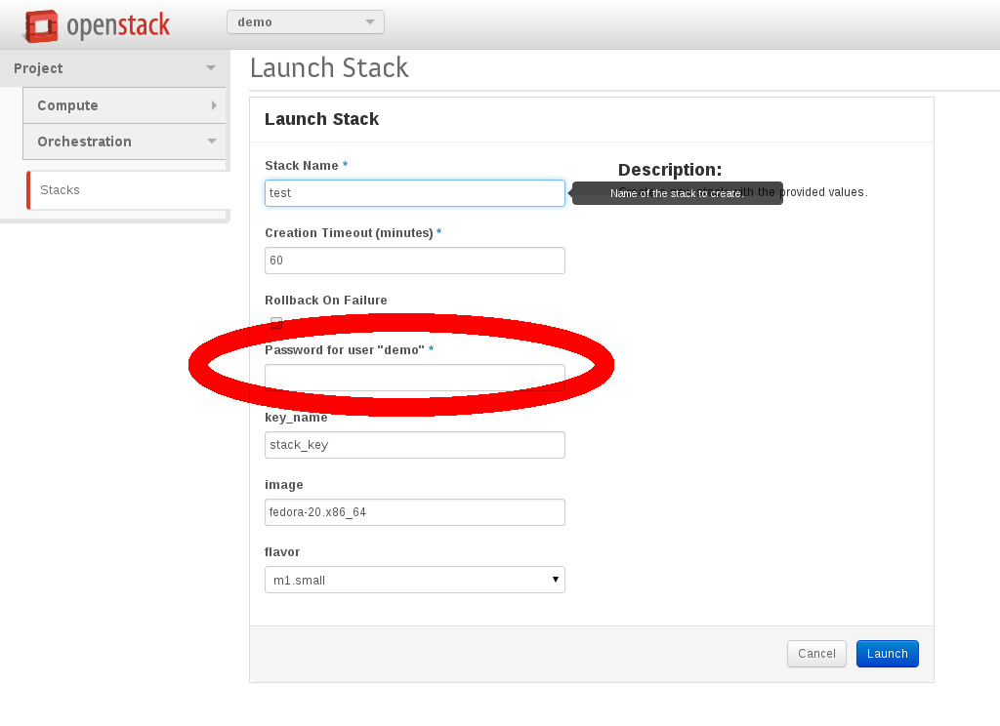

# Heat 认证模型第一部分 - Trusts

翻译：zhangdetong

原作者 Steve Hardy 是Heat社区的以为从很早就参与了设计和开发的一位核心开发者
这篇文章里 Steve 阐述了Heat内部使用的身份认证模型trust，这一认证机制也是keystone实现的多个身份认证模型的一种。
shardy写文章的时间是2014年8月，翻译在2016年11月，文章应以Icehouse版为准。

[原文地址](http://hardysteven.blogspot.co.uk/2014/04/heat-auth-model-updates-part-1-trusts.html)

**译文：**

近几个月我花了很多时间尝试寻找重构Heat认证模型的方法，要解决两个长时间存在的问题：

  1. 在创建stack的时候需要传一个密码，这可能会执行之后的编排任务（例如AutoScaling调整）
  2. 用户创建特定类型的资源时要拥有管理员的role

解决这些问题在Havana和Icehouse版本中都有进行，但经过和同事的讨论后发现社区没有相关的文档会导致困惑。本文意在解决Heat认证模型导致的困惑，并为即将到来的 Icehouse Heat release 提供一些文档，下面的文章是关于“需要传递一个密码”这个问题的讨论以及用来解决这一问题的方法。

## 神马？传密码？难道不传token吗？

当前我们确实传token来进行认证。然而token的问题是它们会过期然后失效，我们也无从得知一个satack什么时候会过期。因此不能在首次创建heat stack后，用存储用户token的方式来继续进行后续的操作。从保障安全的角度来看也并不合理。

在heat的前一个版本中，即便是用户已经传了一个token，还是需要用户再传一个密码。Heat会对密码进行加密后存到heat数据库里，这样一来我们既可以获得一个token也获得密码，就可以替用户进行任何stack的生命周期内其他的后续操作了。这不是一个很好的设计，但是当这个被实现后，Keystone当时并没有Trusts，这样以来就没有了其他可行的方案代替。

流程如下：

 - 用户请求创建stack，提供了一个token和用户名/密码（python-heatclient和Horizon会替用户请求token）
 - 如果stack包含任何被标记为需要进行后续操作的资源的话，如果没有提供用户名/密码则heat将不能验证检查
 - 用户名/密码被加密后存到数据库里
 - stack完成创建
 - 在后面的某个阶段，我们会取回这些身份凭证，并代替用户请求另一个token。这个token不被限制在某个范围内，能够调用stack owver的所有role。

很明显这种实现并不理想，这就是Horizon里这个奇怪的、多出来的密码输入框：

庆幸的是，在和Adam Young讨论后我们得知Trusts在[Grizzly](https://blueprints.launchpad.net/keystone/grizzly)已经实现了，heat在Havana生命周期里已经实现了和trusts功能的整合。在我的印象里很多人还没使用这个功能，因此我们希望我们可以进一步地把[基于trusts的认证方法作为默认方法使用](https://bugs.launchpad.net/heat/+bug/1286157)，最近[devstack已经在这样做了](https://review.openstack.org/#/c/80002/)。

*译注：heat trusts在2015年的kilo版本里就已经实现了，翻译的时候已经在进行O版的开发了。*

## Keystone Trusts 101

因此，在描述Heat存储密码的时候，我会参考[ Keystone Trusts 的文档](https://github.com/openstack/identity-api/blob/master/openstack-identity-api/v3/src/markdown/identity-api-v3-os-trust-ext.md)，因为这是被用于实现这个解决方案的方法。包括[Keystone wiki](https://wiki.openstack.org/wiki/Keystone/Trusts)、[Adam Young的博客](http://adam.younglogic.com/2013/03/trusts-rbac)和[API文档](https://github.com/openstack-attic/identity-api/blob/master/v3/src/markdown/identity-api-v3-os-trust-ext.md)都是很好的参考资料。
简单地总结这个属于就足够我们理解Heat里是如何使用trusts的了：

  Trusts是一个keystone的扩展，它提供了一个方法可以通过keystone实现代理和有选择的模拟。最重要的属于是trustor和trustee。

*译注： trustor指委托方，trustee指被委托方。当trustor进行了一次trust操作之后，被信任的人(trustee)就可以使用这个trust来进行认证操作，获得被授予的那些权限。*

要创建一个trust，trustor（在此处指的就是创建heat stack的用户）要把下列信息提供给keystone：

 - trustee的ID（就是你想要谁代理，在这里就指的是heat service用户）
 - 将要被授予的roles（通过heat配置文件可以设置，但是需要包含要代表用户来执行后续的操作的任何roles，例如相应一个AutoScaling事件创建一个nova实例）
 - 是否启用模拟

提供这些信息之后Keystone就会提供一个 trust_id ，它可以被trustee用于获取一个用于仅限于trust内使用的token，且只能被trustee使用。如果在创建trust的时候选择了role，这个token被限制于这个范围内，这样一来trustee只有有限的权限可以访问被授予的roles，以及有效地模拟trustor用户。

*译注： 这样说来社区在kilo版本里把heat配置文件的trust_delegated_roles从['heat_stack_owner']设成了默认为空，问题来了，这是又是为什么呢。。*

## 所以我们是怎么解决heat认证问题的呢？

现在heat会这么干：

 - 用户通过一个API请求创建一个stack（只需要传递token）
 - Heat使用token，在stack owner（trustor）和heat service 用户（trustee）之间创建一个trust，把一个或多个特别的role以list的结构赋值到heat配置文件的 heat_stack_owner 里。默认heat设置这个heat_stack_owner参数为“heat_stack_owner”。在用户创建stack的时候，“heat_stack_owner”这个role必须存在，且“heat_stack_owner”已经被分配到*用户正在创建stack*的那个project里面。
 - Heat把trust id存储到heat数据库里（依然是加密后存储，尽管理论上来讲不需要加密，因为这个id对trustee以外的其他人并没有作用，例如对 heat service 用户来说就没用）
 - 当需要执行一个延后的操作时，Heat会去取这个trust id,还会请求一个“trust scoped token”。这个token让service用户可以在这个延后操作中模拟stack owner，例如在响应AutoScaling时间时代表stack owver创建一些nova实例。

这个方法的好处很清晰，需要明确几点：

 - 这种方法对用户更好，我们不再需password，通过提供一个token就可以使用完整的功能了（就像其他Openstack服务一样。也终于可以去掉Horizon的密码输入框了。）
 - 这种方法更加安全，因为我们不需要再存任何证书或是其他有可能被任何攻击者利用的数据了。trust_id只能被trustee使用，即heat service用户。
 - 这种方法使得heat可以实现粒度更细的延后操作，例如如果stack owner有管理员role，那么就不再需要把它们赋值给heat了，只需要提供子集就可以了。

我建议所有人都转而使用这个特性，使用这个特性很简单，首先升级 heat.conf 文件，使得其中包含下面两行配置：

  deferred_auth_method=trusts
  trusts_delegated_roles=heat_stack_owner

但愿这个配置能够尽快在Juno版本成为默认的Heat配置。

接下来要使得所有创建heat stack的用户都有“heat_stack_owner”role，或者是其他基于你本地的RBAC规则的，要委托给heat service用户的自定义用户。

*下一篇文章Steve写了关于stack domain users，我也将翻译这片博客。感谢阅读。*
