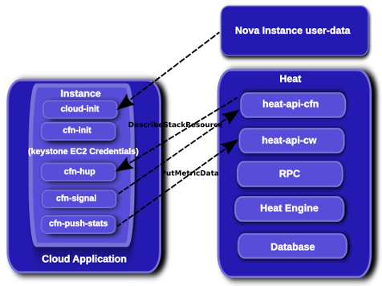

# Heat 认证模型第二部分 - Stack Domain Users

原作者 Steve Hardy 是Heat社区的以为从很早就参与了设计和开发的一位核心开发者。
作者写作时间是2014年8月，和上一篇一样，应该以Icehouse版本为准。
翻译时间为2016年11月，Ocata版本正在开发中。

[原文地址](https://hardysteven.blogspot.com/2014/04/heat-auth-model-updates-part-2-stack.html?showComment=1480042996365#c9135691387438895727)

这篇文章里涉及到了最近被实现的[实例用户blueprint](https://blueprints.launchpad.net/heat/+spec/instance-users)，其中使用了keystone的[domain](https://github.com/openstack-attic/identity-api/blob/master/v3/src/markdown/identity-api-v3.md#domains-v3domains)，domain中用户相关的证书，这些证书是在heat创建的实例里部署的。

## 所以为什么heat要创建用户呢？

这就说来话长了。Heat由于历史原因，需要完成以下几方面功能：

  1. 给实例里面的agent提供meatadata，agent会轮询是否有改变并把metadata里面的配置都应用到实例里面去。
  2. 发出信号表示一些动作完成，尤其是在一台启动的虚拟机上配置软件（因为nova一旦生成了一台VM，就把它的状态变为“Active”，不是当heat已经把他配置完成才改变状态）
  3. 提供实例内部应用级的状态或指标，例如允许在一些服务的性能指标或质量指标改变时执行AutoScaling操作。

Heat提供了可以实现所有这些功能的API，但是这些API需要某种认证，例如证书，这样无论什么agent在实例上运行都可以访问之。因此证书必须被不熟在实例内部，例如下面的图片展示了如果使用heat-cfntools的agent会发生些什么：

heat-cfntools agent使用签名的请求，签名请求需要一个通过keystone创建的ec2秘钥，这个秘钥用于给heat cloudformation和cloudwatch兼容的API的请求签名。这些API是通过签名验证（需要keystone的ec2tokens扩展）的方式被heat认证的。

问题是，ec2密钥对是和一个用户挂钩的。我们不想部署直接于stack owner相关的证书，否则任何（隐式不可信的）实例的缺陷都可能导致一个巨大的缺陷，即攻击者可以控制有stack访问权限的用户可以访问的任何内容。

我用cfntools/ec2tokens举了个例子，如果使用任何可以通过keystone获取（如token，username/password）、可以用来通过heat API进行认证的证书，相同的问题都会存在。

因此我们需要分离的、隔离的证书部署到实例里。这样一来我们可以把允许的访问行为限制到所需的最少情况。我们的第一次尝试是这样的：

 - 在和stack owner同一个project下用Keystone里创建一个新用户（即可以明确地通过User和AccessKey资源创建也可以用WaitConditionHandle和ScalingPolicy资源。我们从内部获取一个ec2秘钥，用于产生一个没有被签过名的URL）
 - 添加“heat stack user”到一个特殊的role——默认的“heat_stack_user”里面（通过配置heat.conf里的heat_stack_user_role进行修改)
 - 通过policy.json来限制API接口的访问，我们期望其他服务也会像这样被限制，或是通过网络隔离/防火墙规则来完全禁止访问。

这种方式有缺陷，这个缺陷导致了这个[长期存在的bug](https://bugs.launchpad.net/heat/+bug/1089261),这个问题有集中解决方法：

- 需要创建stack的用户被允许在keystone中创建用户，这必然需要有管理员权限的role。
- 不能提供完全的隔离，即便是policy规则，依然是可能存在有缺陷的stack被滥用于认证（例如把用户在同一项目中获取的metadata用于其他stack）
- 这样会把项目的用户列表用假用户（对于用户和操作者的角度看来）弄得混乱，这些用户只是heat实现的细节，我们也把它们都暴露给了终端用户。

## 这听起来挺差的，有木有其他方法呢？

我们已经思考了有段时间了，我们讨论了很多种解决方案：

 - 通过trusts授权一个用户role的子集（驳回）
 - 基于一些随机的“token”来搞我们自己的认证机制（一些人觉得这个想法不错，但是我反对之）
 - 使用keystone的OAuth秘钥和签名请求（由于keystoneclient不支持而驳回）
 - 通过创建一个完全隔离的heat专用的keystone domain，从而隔离实例里面的用户。这个方案是 [Adam Young](http://adam.younglogic.com/category/software/openstack/) 提出的，也是我们在[Icehouse版本中进行实现的方案](https://blueprints.launchpad.net/heat/+spec/instance-users)。

## “Stack Domain Users”的细节

新的方法是有效的，一个对已有的实现进行的优化。我们封装了所有stack定义的用户（即由于heat模板里的内容而被创建的用户），把他们放到了一个另外的domain里，这个domain特别用来包含
